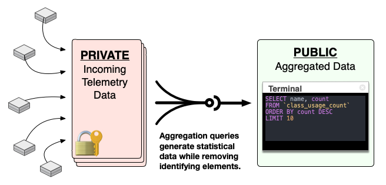

# Dropsonde

A simple telemetry probe for gathering non-identifiable information about Puppet
infrastructures.


## Overview

We both know that you hate telemetry as much as I do. So what makes this different?
At its core, the purpose and design of this module is for your own benefit as much
as it is for ours. Think back to the time you last visited the Forge to find a
module. Chances are that you discovered many modules that claimed to solve your
problem and it was relatively difficult choosing between them. Surfacing usage
data in a way that lets you signal approval simply by using a module is the
primary goal of this project.

> **This means that the best way for you to help yourself find new modules is to
> opt in and use this telemetry tool to share your module usage data.** ✅


## Design

So what sort of information is gathered? Dropsonde identifies information like
which public modules and classes are used, and what platforms they're used on.
It identifies the component classes that your profile modules declares so we can
better support what you are doing with your profiles, *but without exposing your
profile names.* The key point here is that it looks for usage patterns for *public
modules only* and explicitly does its best to keep your internal code private to you.

You can see exactly what will be phoned home by running the command:

```
$ dropsonde preview
```

> *Note:* as of Puppetserver 7.5.0, Dropsonde is bundled in as a standard `puppetserver`
> command. You should run it as `puppetserver dropsonde` (or `/opt/puppetlabs/bin/puppetserver
> dropsonde` if your `$PATH` isn't configured.)

Dropsonde is a simple telemetry probe designed to run both as a command-line
tool and optionally as a regularly scheduled task. Metrics are defined by
plugins that gather data, but also export a schema that constrains the data
allowed to be reported on. Dropsonde will reject metrics that don't meet these
constraints. The backend database is also defined by this schema so the system
cannot gather any data that's not described in the schema.

See the full schema of all enabled plugins by running the command:

```
$ dropsonde dev schema
```

All information in the report is keyed off a non-reversible SHA512 hashed site-id
to make it unidentifiable; this report cannot be linked back to you or to your
infrastructure. Now that said, we know that the more bits of data shared about a
specific site, the easier it is to fingerprint that site. See
[Panopticlick](https://panopticlick.eff.org) for a real-world example.

To mitigate this concern, we aggregate data in a two step process. The data
submitted by Dropsonde is stored in a private dataset. ACLs limit access to only
certain number of employees. Then each week, a job runs to generate a sanitized
and aggregated form of the data for the week which goes into the public dataset
that all our tooling actually depends on and uses. This dataset includes patterns
and aggregate data, but does not include any individual records whatsoever.

For example, this aggregated data might include records that show a count of how
many sites are using various combinations of modules together, but it will never
include a record showing the full list of modules that any single site is using.



With your own Google Cloud account, you can use that [dataset](https://console.cloud.google.com/bigquery?p=dataops-puppet-public-data&d=community&t=forge_modules&page=table)
in your own tooling and you can see/contribute to the aggregation queries in its
own [repository](https://github.com/puppetlabs/dropsonde-aggregation).


## Privacy

Dropsonde will not collect the names or titles of internal modules, classes,
facts, types, etc. It will gather the names of the component classes that your
profiles use, but it will not gather the names of your profiles themselves. In
order to maintain data integrity, reports are keyed off a non-reversible site-id.
This means that there's no direct link from a record to you or your infrastructure,
but it does mean that the data could be used for fingerprinting. To mitigate that,
the data goes through an additional aggregation step that removes this ID and
presents only usage patterns publicly.

If you identify an unmitigated privacy concern then please inform us as soon as
possible: [privacy@puppet.com](mailto:privacy@puppet.com)


## Installation

As of Puppetserver 7.5.0, Dropsonde is bundled in as a standard `puppetserver`
command. If you're running an older version, you can install it yourself with
`gem install dropsonde` or let the
[Puppet module](https://github.com/puppetlabs/puppetlabs-dropsonde) manage it
for you.


## Configuration

Any command line arguments can also be specified in `/etc/puppetlabs/telemetry.yaml`.
For example the config file below will disable Forge module cache updating and
will not report the `:puppetfiles` metrics.


``` yaml
---
:update: false
:disable:
  - puppetfiles
```

The [`puppetlabs-dropsonde`](https://github.com/puppetlabs/puppetlabs-dropsonde)
Puppet module manages this configuration for you.


## Scheduled Reporting

Dropsonde is intended to run on a regular schedule to submit usage reports back
to Puppet. The [`puppetlabs-dropsonde`](https://github.com/puppetlabs/puppetlabs-dropsonde)
Puppet module will manage this for you, or you can follow the instructions below
to configure a schedule manually.

If you're running Puppetserver 7.5.0 or above, it's already set up so you can
simply opt in. Add or update the following stanza of
`/etc/puppetlabs/puppetserver/conf.d/puppetserver.conf`:

``` hocon
dropsonde: {
    enabled: true
}
```

If you're running an older version of Puppetserver, then create a cron job that
runs `dropsonde submit` once a week.


## Running

Run `dropsonde --help` to see usage information.

* `preview`
    * Generate and print out an example telemetry report in human readable form
    * Annotated with descriptions of each plugin and each metric gathered.
* `list`
    * See a quick list of the available metrics and what they do.
* `submit`
    * Generate and submit a telemetry report. This will be exactly the same as
      the human readable form, just in JSON format.
* `update`
    * Once a week, the list of public modules on the Forge will be updated. This
      command will manually force that cache update to happen.

Developer comands

* `dev example`
    * To make writing aggregation queries possible without access to the private
      database, this will generate a randomized example of the dataset. This is
      in JSONL format, so it can be imported directly into BigQuery.
* `dev schema`
    * Generate and print out the complete combined schema of all metrics.
* `dev shell`
    * Open up a Pry shell with all the relevant connections open and initialized.


## Architecture

Dropsonde is a simple telemetry probe designed to run as a scheduled task. It
will gather metrics defined by self-contained plugins that each defines its own
partial schema and then gathers the data to meet that schema.

Metrics plugins live in the `lib/dropsonde/metrics` directory. See the existing
examples for the API. All data returned must match the schema the plugin defines
and each column in the schema must be documented.

Dropsonde maintains a cache listing all the public modules existing on the Forge.
This is used for identifying public modules and ensuring that information about
your internal modules is not leaked outside your network. Once a week, this cache
of modules is updated.


## Limitations

The output format of individual metrics is not yet formally defined. If you write
tooling to use it, then make your tooling resilient to changes.


Contact
-------

community@puppet.com

